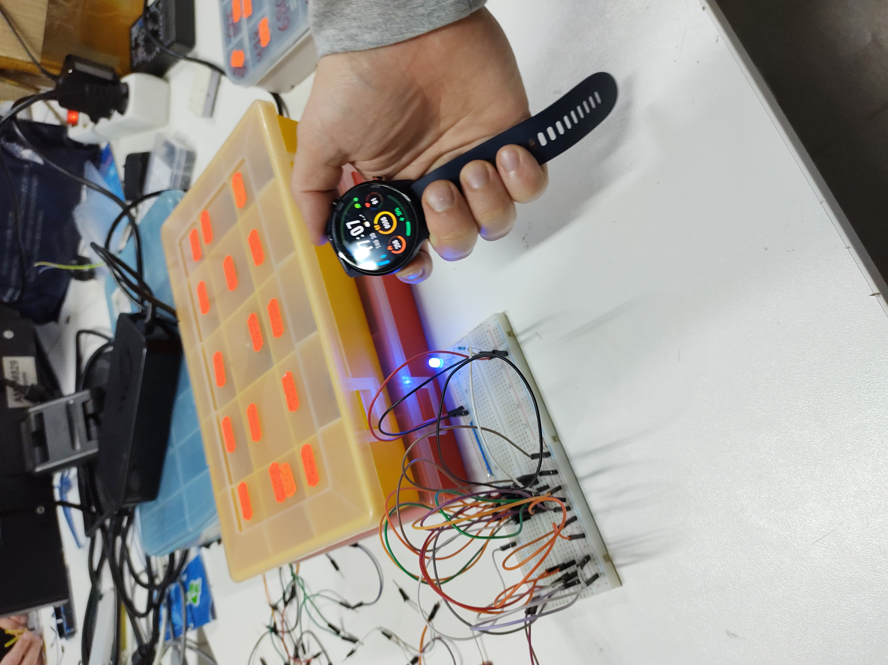

# Synthesis of logic circuits
Accepted by **Dmytro Kushnir**  
Done with 2 additional tasks

## Task
Implement the function from simple logical elements,
defined by the following vector: **11100010**

## Implementation using NAND
### Used logical elements
- NAND ([CDx4HCT00](https://www.tij.co.jp/jp/lit/ds/symlink/cd54hct00.pdf))
### Diagram

### Result

## Implementation using MUX
### Used logical elements
- MUX ([74HC151](https://assets.nexperia.com/documents/data-sheet/74HC_HCT151.pdf))
### Diagram

### Result

