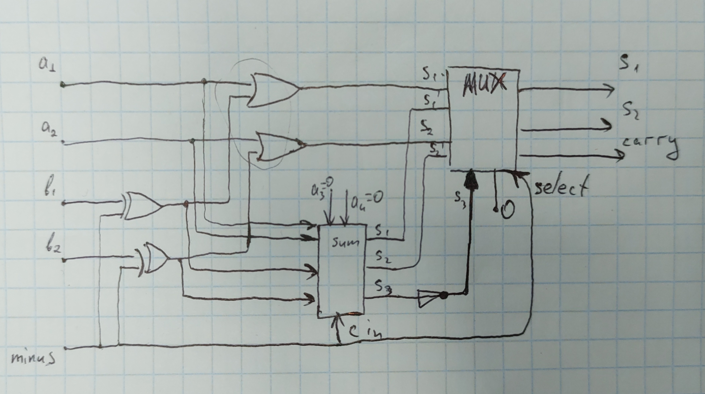
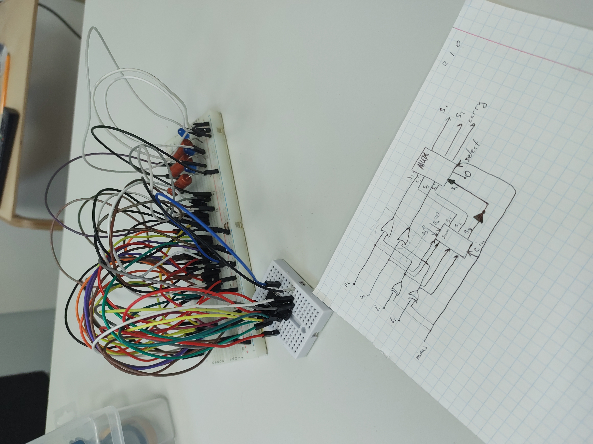

# Construction ALU
Accepted by **Muralllka**

## Task
Implement ALU With given list of properties

## OR and subtraction of two 2-bit numbers.

### Used logical elements
- XOR ([CDx4HCT86](https://www.tij.co.jp/jp/lit/ds/symlink/cd54hct86.pdf))
- OR ([CDx4HCT32](https://www.tij.co.jp/jp/lit/ds/symlink/cd54hct32.pdf))
- Sum ([CD54HC283](https://www.tij.co.jp/jp/lit/ds/symlink/cd74hct283.pdf))
- MUX ([74HC257](https://assets.nexperia.com/documents/data-sheet/74HC_HCT257.pdf))
### Diagram

### Result

