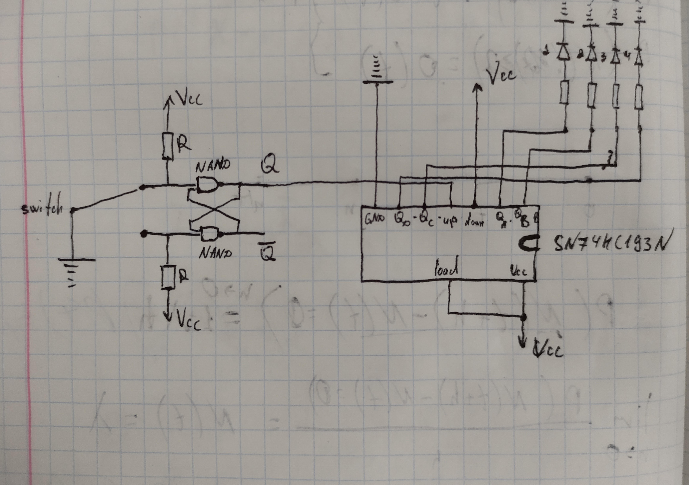

# Hardware counter
Accepted by **Dmytro Kushnir**

## Task
Implement a 4-bit counter of number of switches.  
Provide hardware fight against the contacts bouncing.

## Used logical elements
- NAND ([CDx4HCT00](https://www.tij.co.jp/jp/lit/ds/symlink/cd54hct00.pdf))
- Counter ([SN74LS193](https://www.ti.com/lit/ds/symlink/sn74ls193.pdf))
## Diagram

## Result

